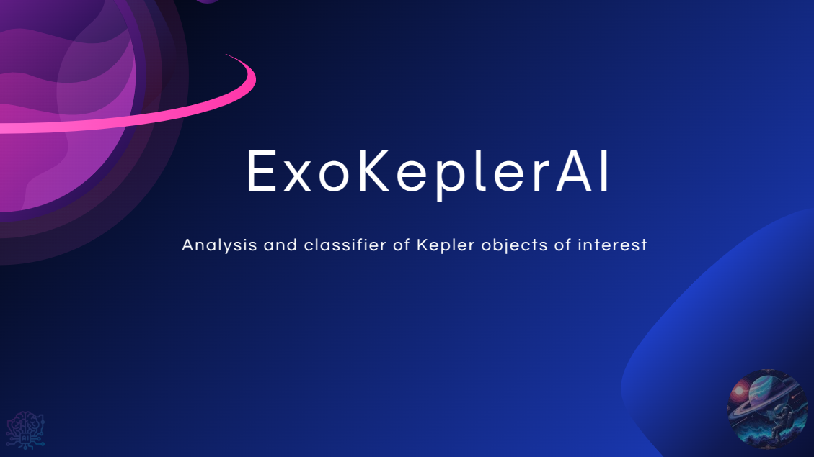

# ExoKeplerAI - NASA Space Apps Challenge 2025


**ExoKeplerAI** is a comprehensive artificial intelligence platform designed to analyze Kepler Objects of Interest (KOI) data and classify potential exoplanets. Using a powerful Machine Learning model (XGBoost) and a Large Language Model (LLM) for result interpretation, this tool enables both researchers and astronomy enthusiasts to identify and understand discoveries from the Kepler mission.

The system classifies each KOI into one of three categories:
*   🪐 **CONFIRMED**: The object is a confirmed exoplanet.
*   ✨ **CANDIDATE**: The object has high potential to be an exoplanet and requires further analysis.
*   🚫 **FALSE POSITIVE**: The object is likely not an exoplanet (e.g., stellar noise, eclipsing binary star).

##  Interface Demo

 <!-- Replace with a screenshot of your UI -->

---

## 🏛️ System Architecture

The project is built on a modern microservices architecture that separates frontend, backend, and AI model logic, ensuring scalability and maintainability.

1.  **Frontend (React)**:
    *   An interactive and responsive web user interface built with React and styled with Tailwind CSS.
    *   Allows users to upload CSV files with KOI data or manually input parameters for a single object.
    *   Visualizes results, including a 3D comparative representation of the exoplanet, its host star, and Earth, created with Three.js.
    *   Displays detailed analysis generated by an LLM.

2.  **Backend (FastAPI)**:
    *   A high-performance API built with FastAPI (Python) that serves as the system's brain.
    *   Exposes a `/predict` endpoint that receives KOI data.
    *   Orchestrates calls to the Machine Learning model and LLM service.

3.  **Machine Learning Model (XGBoost)**:
    *   A pre-trained XGBoost model (`exoplanet_model.json`) that performs the primary classification.
    *   Was trained with the [NASA cumulative KOI dataset](https://exoplanetarchive.ipac.caltech.edu/docs/data.html).
    *   Analyzes 16 key features to determine the probability of each classification.

4.  **LLM Analysis (ChatGroq)**:
    *   Integrated through the backend, this service receives input data and XGBoost model results.
    *   Generates a detailed, natural language explanation of why the model made that decision, making results accessible to a broader audience.

 <!-- Replace with your architecture diagram -->

---

## ✨ Key Features

*   **Dual Input Mode**:
    1.  **CSV Upload**: Analyze a CSV file with KOI data.
    2.  **Manual Input**: Manually enter 16 object parameters for instant analysis.
*   **Analytics Results Dashboard**:
    *   Shows final classification (`CONFIRMED`, `CANDIDATE`, `FALSE POSITIVE`) and associated probabilities.
    *   Includes interactive visualization to compare the size of the exoplanet, its star, and Earth.
*   **Advanced AI Analysis**:
    *   The "Advanced Analysis" tab offers an LLM-generated explanation that interprets KOI characteristics and justifies the model's result.
*   **High-Precision Model**: The underlying XGBoost model was trained and evaluated to deliver reliable results.

---

## 🤖 The Machine Learning Model

The platform's core is an XGBoost classifier trained to distinguish between confirmed exoplanets, candidates, and false positives.

## Kids Mode

The platform features an interactive children's mode so kids can learn about KOIs and how exoplanets are identified.

### Features Used

The model was trained using the following 16 features:

1.  `koi_period`: Orbital Period (days)
2.  `koi_impact`: Impact Parameter
3.  `koi_duration`: Transit Duration (hours)
4.  `koi_depth`: Transit Depth (ppm)
5.  `koi_prad`: Planetary Radius (Earth radii)
6.  `koi_teq`: Equilibrium Temperature (K)
7.  `koi_insol`: Insolation Flux (Earth flux)
8.  `koi_model_snr`: Transit Signal-to-Noise
9.  `koi_steff`: Stellar Effective Temperature (K)
10. `koi_slogg`: Stellar Surface Gravity (log10)
11. `koi_srad`: Stellar Radius (solar radii)
12. `koi_kepmag`: Kepler Magnitude
13. `koi_fpflag_nt`: "Not Transit-Like" Flag (0 or 1)
14. `koi_fpflag_ss`: Stellar Eclipse Flag (0 or 1)
15. `koi_fpflag_co`: Centroid Offset Flag (0 or 1)
16. `koi_fpflag_ec`: Ephemeris Match Flag (0 or 1)

### Performance Metrics

The model has demonstrated solid performance on the test dataset:

*   **Overall Accuracy**: **92.00**

#### Classification Report:
| Class          | Precision | Recall | F1-Score | Support |
|----------------|-----------|--------|----------|---------|
| CANDIDATE      | 0.76      | 0.65   | 0.70     | 176     |
| CONFIRMED      | 0.89      | 0.93   | 0.91     | 520     |
| FALSE POSITIVE | 0.99      | 0.99   | 0.99     | 382     |
| **Weighted Avg**   | **0.90**      | **0.91**   | **0.90**     | **1078**    |

*(Confusion Matrix and Feature Importance graphs are generated during training in `confusion_matrix.png` and `feature_importance.png`)*

---

## 🛠️ Technology Stack

*   **Frontend**: React, Tailwind CSS, Three.js, Recharts, PapaParse
*   **Backend**: Python, FastAPI
*   **Machine Learning**: XGBoost, Pandas, Scikit-learn
*   **LLM**: langchain (`Groq API Service - GPT-OSS-20b`)

---

## 🚀 Installation and Usage Guide

Follow these steps to run the project in your local environment.

### Prerequisites

*   Python 3.8+
*   Node.js v16+ and npm/yarn
*   A Groq API key

### 1. Backend Setup

```bash
# 1. Clone the repository
git clone https://github.com/A-team-Nasa/exoplanet-detector.git
cd exoplanet-detector
cd api

# 2. Create and activate a virtual environment
python -m venv venv
source venv/bin/activate  # On Windows: venv\Scripts\activate

# 3. Install Python dependencies
pip install -r requirements.txt  # Make sure you have a requirements.txt file

# Add your Groq API Key as an environment variable
echo "GROQ_API_KEY=YOUR_API_KEY" > .env

# 4. Configure environment variables
# Create a file called .env in the project root and add your API key:
# GROQ_API_KEY="your_secret_groq_key"

# 5. Start the FastAPI server
uvicorn main:app --reload
```
The backend will now be running at `http://127.0.0.1:8000`.

### 2. Frontend Setup

```bash
# 1. Navigate to the frontend directory (assuming it's in a 'frontend' folder or similar)
cd frontend/

# 2. Install Node.js dependencies
npm install

# 3. Start the React application
npm start
```
The user interface will now be accessible at `http://localhost:3000`.

### 3. (Optional) Retrain the Model

If you want to retrain the model with an updated dataset:
1.  Place the new CSV file (e.g., `cumulative_new.csv`) in the `api/utils/` directory
2.  Modify the file path in `xgbost_train.py` if necessary.
3.  Run the training script:
    ```bash
    python xgbost_train.py
    ```
This will generate a new `exoplanet_xgboost_model.json` file and metric graphs.

---

## 📂 Project Structure

```
.
├── web/                 # React application directory
│   ├── src/
│   │   ├── components/       # React components (Form, Charts, 3D)
│   │   ├── services/         # API logic (api.js)
│   │   └── App.jsx           # Main application component
│   └── ...
├── api/    
    ├── utils/                # Utilities folder
    │    ├── xgbost_train.py  # Script to train the XGBoost model
│   ├── main.py               # Main API logic and /predict endpoint
│   ├── model_xg.py           # Functions to load model and predict
│   ├── llm_connection.py     # LLM connection using langchain
│   ├── exoplanet_model.json  # The trained AI model
│   └── ...
└── README.md                 # This file

```